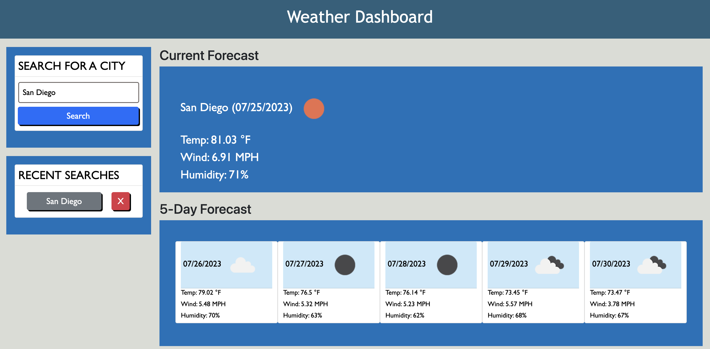

# Weather Dashboard

## Description

- Create a Weather Dashboard that can lookup current and future weather forecasts for a given city
- Weather forecasts include: 
  - An icon indicating the weather
  - Temperature
  - Wind speed
  - Humidity 
- Searched cities will be saved in localStorage and can be accessed through a search history for future reference

## Link to deployed application
https://matthkang.github.io/weather-dashboard/

## Table of Contents (Optional)

- [Usage](#usage)
- [Credits](#credits)

## Usage
Weather application displaying the <ins>current</ins> and the <ins>next 5 days</ins> forecast

- You can search for a city in the search bar. 
- Searching for a city will add it to list of recent searches to retrieve the weather forecast again.

## Credits
- https://stackoverflow.com/questions/3304014/how-to-interpolate-variables-in-strings-in-javascript-without-concatenation
- https://stackoverflow.com/questions/17634019/javascript-load-an-image-from-url-and-display
- https://stackoverflow.com/questions/4323848/how-to-handle-button-click-events-in-jquery
- https://www.freecodecamp.org/news/javascript-refresh-page-how-to-reload-a-page-in-js/#:~:text=The%20simplest%20way%20to%20refresh,and%20loading%20the%20latest%20content.
